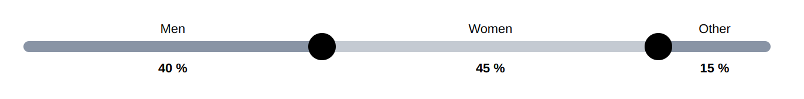

# React Multi Range Slider

A lightweight customizable React multi-range slider built using Vite and styled components.

This slider is designed to empower you in scenarios such as repartitions, percentage distribution, and more.

<br />

### Key features

**Dynamic Thumb Configuration:** Easily set the number of thumbs according to your requirements, offering flexibility in user interaction and data representation.

**Style Customization:** Tailor the appearance of the slider and thumbs effortlessly. Feel free to adapt the provided styled components to your preferred styling methods, whether it's pure CSS or alternative styling approaches.

**Precision Control:** Define the step size, minimum, and maximum values for precise control over the slider's behavior, ensuring seamless integration with your application's specific needs.

<br />

# Props

Here are the props that control and customize the component:

|props   | type | required | default | description |
| ------------ | ------------ | ------------ | ------------ | ------------ |
| values  | number[]  | true | | Values of the slider. The length of the array will define the number of thumbs |
| labels  | string[]  | false | [] | Labels of the values. The indexes of the labels array match the values array indexes |
| unit  | string  | false | '' | Unit of the values displayed next to each of them |
| min  | number  | false | 0 | Minimum value that the user can set for each value of the values array |
| max  | number  | false | 100 | Maximum value that the user can set for each value of the values array |
| step  | number  | false | 1 | Value change when the user interacts with the slider |
| onChange  | (newValues: number[]) => void | true | | Function that updates the values when the user interacts with the slider |
| ref | React.MutableRefObject<HTMLDivElement l null> | false | | React ref added to the main container |
| color | string | false | '#142a4c80' | Main color of the slider bar |
| secondaryColor | string | false | | If given, one of two values will be of this color alternatively |
| barHeight | number | false | 12 | Bar height in px |
| thumbWidth | number | false | 30 | Thumb width in px |
| thumbHeight | number | false | 30 | Thumb height in px |
| thumbColor | string | false | 'black' | Thumb color |
| thumbStyle | React.CSSProperties | false | | Override default style with inline style on the thumb |
| containerStyle | React.CSSProperties | false | | Override default style with inline style on the main container |

<br />

# Example


<br/>

```
import React, { useState } from "react"
import MultiRangeSlider from "react-multi-range-slider"

const MySlider = () => {
  const [values, setValues] = useState([40, 45, 15])

  const labels = ['Men', 'Women', 'Other']

  return (
    <MultiRangeSlider
      values={values}
      labels={labels}
      onChange={setValues}
      color='#142a4c80'
      secondaryColor='#142a4c40'
      min={0}
      max={100}
      step={5}
      unit='%'
    />
  )
}

export default MySlider
```

<br />

# License

MIT License (Free to use)

<br /><br />

# Author

**Camille Durthaller-Renard**

Contact: camilledr10@gmail.com
